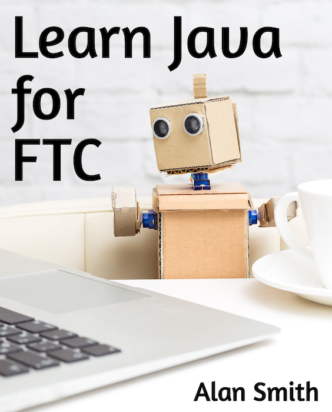

[PDF of the book contents](LearnJavaForFTC.pdf)

1. The book is available for purchase as a paperback on Amazon at: https://www.amazon.com/dp/B08DBVKXLZ
2. I have tested all programs in the book to make sure they work at this point.
   (Except the ones in the Rumble chapter and the opmodes in the EasyOpenCV chapter)
3. I would *love* it if you would put [your comments here](https://github.com/alan412/LearnJavaForFTC/issues/new?assignees=&labels=&template=book-comments.md&title=)   

All of the samples have been tested and the most recent build was with 10.1