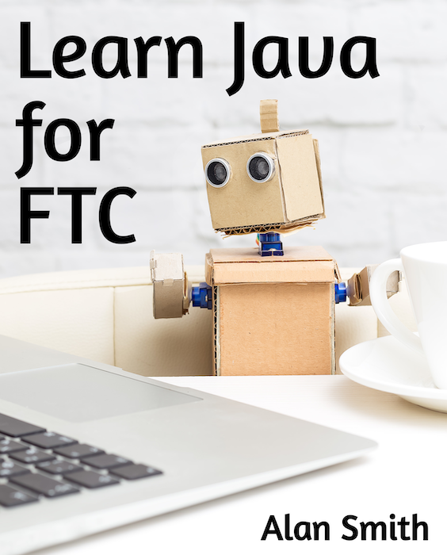

[PDF of the book contents](LearnJavaForFTC.pdf)

1. The book is available for purchase as a paperback on Amazon at: https://www.amazon.com/dp/B08DBVKXLZ
2. I have tested all programs in the book to make sure they work at this point.
   (Except the ones in the Rumble chapter and the opmodes in the EasyOpenCV chapter)
3. I would *love* it if you would put [your comments here](https://github.com/alan412/LearnJavaForFTC/issues/new?assignees=&labels=&template=book-comments.md&title=)   
4. All solutions for the book are in the solution directory on this repo

All of the samples have been tested and the most recent build was with 11.2

If you would like to thank me for providing this, then you can: 

